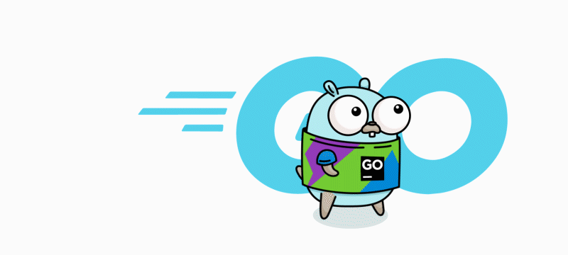

<!-- Banner GIF -->
<p align="center">
  
</p>

# 🎉 My Go Project

[](https://pkg.go.dev/github.com/anantacoder/GO)
[](https://github.com/AnantaCoder/GO/actions)
[](LICENSE)

---


---

## 🔥 Features

- ✅ **Fast**: Compiled to native code for maximum performance  
- 📦 **Simple**: Zero-dependency, easy to get started  
- 🤝 **Concurrent**: Utilizes goroutines and channels  
- ⚙️ **Configurable**: Supports JSON/YAML configuration files  

---

## 📦 Installation

```bash
# Clone the repo
git clone https://github.com/anantacoder/yourrepo.git
cd yourrepo

# Build the binary
go build -o myapp ./cmd/myapp

# (Optional) Install to your $GOPATH/bin
go install github.com/anantacoder/yourrepo/cmd/myapp@latest
